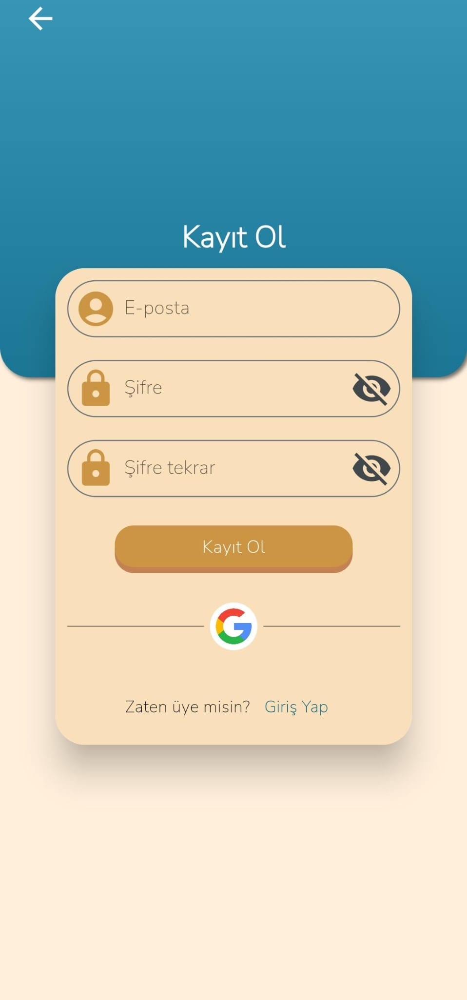
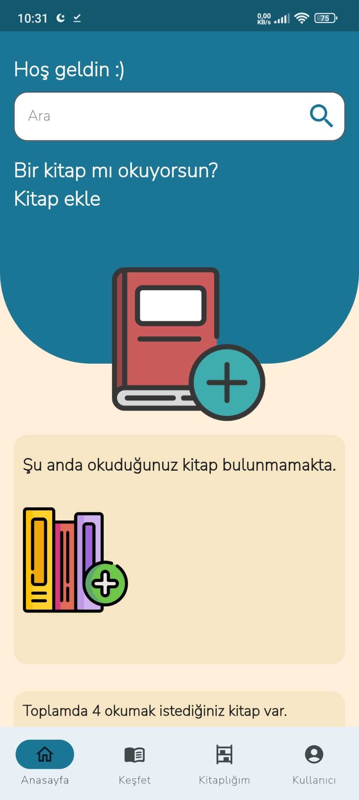
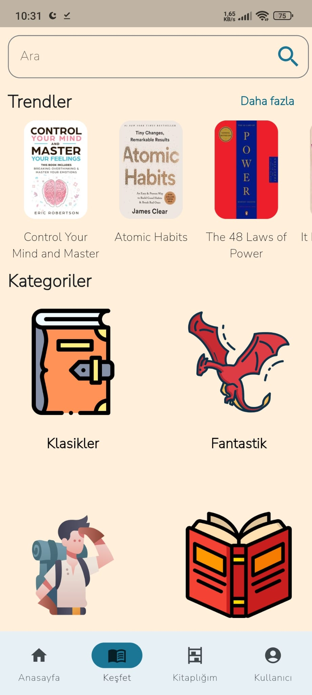
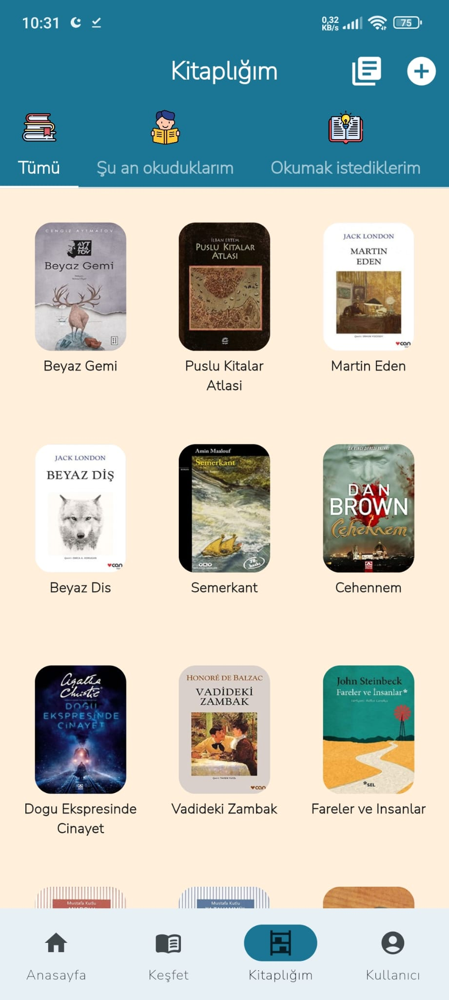
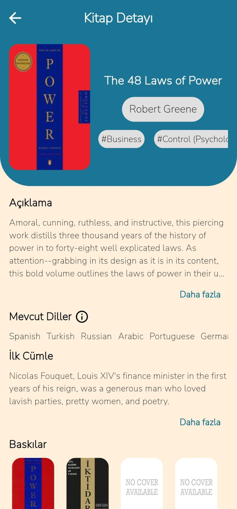
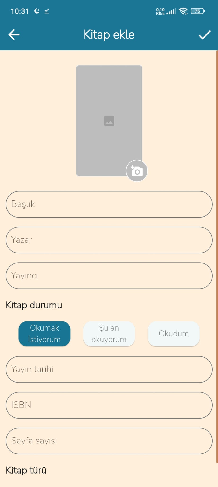
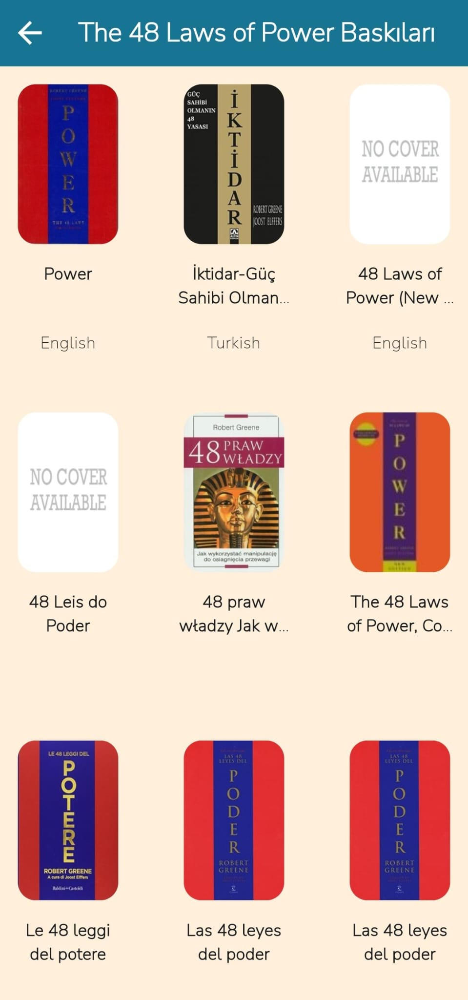
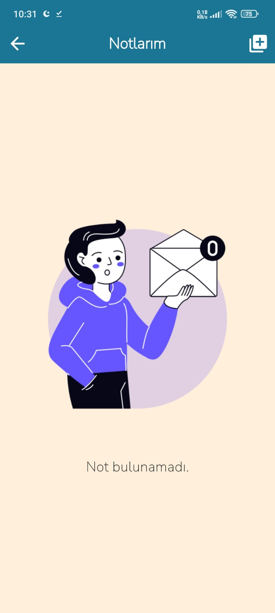
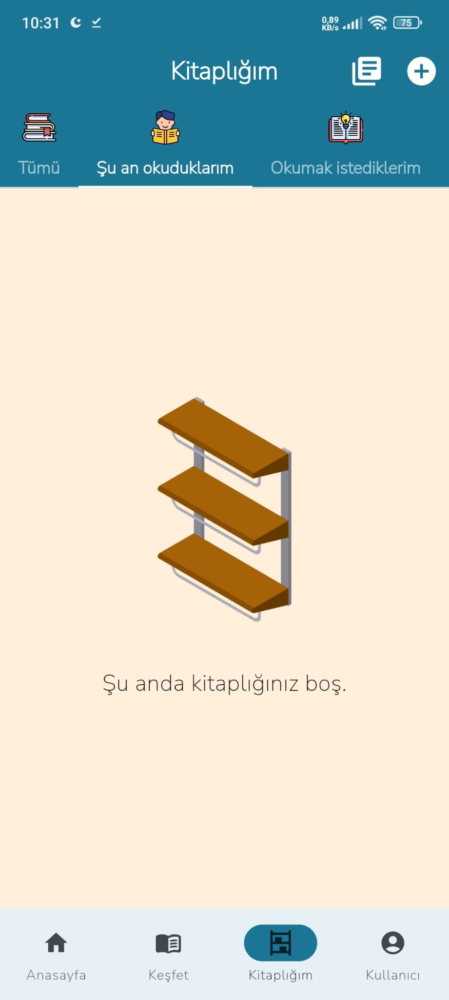

# book_tracker

A mobile application built with Flutter where you can explore books and view details about them, including author information. You can add books to your personal shelf and mark them as "Already Read," "Want to Read," or "Currently Reading." Additionally, notes can be added to the book. Books don't have to be limited to the existing list; you can manually add any book as well. No need to worry about losing your books in the future – sign in to the application and your books will be securely stored on our server.

## Screenshots
<table>
  <tr>
     <td>Register Screen</td>
     <td>Sign In Screen</td>
  </tr>
  <tr>
     <td width="33%"></td>
     <td width="33%"></td>
  </tr>
 </table>

<table>
  <tr>
     <td>Home Screen</td>
     <td>Explore Screen</td>
     <td>My Library Screen</td>
     <td>Profile Screen</td>
     
    
  </tr>
  <tr>
     <td width="25%"></td>
     <td width="25%"></td>
     <td width="25%"></td>
     <td width="25%"></td>
    
  </tr>
 </table>
<table>
  <tr>
     <td>Book Detail Screen</td>
     <td>Add Book Screen</td>
     <td>Category Search Screen</td>
  </tr>
  <tr>
     <td width="33%"></td>
     <td width="33%"></td>
     <td width="33%"></td>
  </tr>
 </table>

 <table>
  <tr>
     <td>Author Detail Screen</td>
     <td>Change Book Status</td>
     <td>Detailed Edition View</td>
  </tr>
  <tr>
     <td width="33%"></td>
     <td width="33%"></td>
     <td width="33%"></td>
  </tr>
 </table>

  <table>
  <tr>
     <td>Editions Screen</td>
     <td>Notes Screen</td>
     <td>Library No Book Screen</td>
  </tr>
  <tr>
     <td width="33%"></td>
     <td width="33%"></td>
     <td width="33%"></td>
  </tr>
 </table>
 
